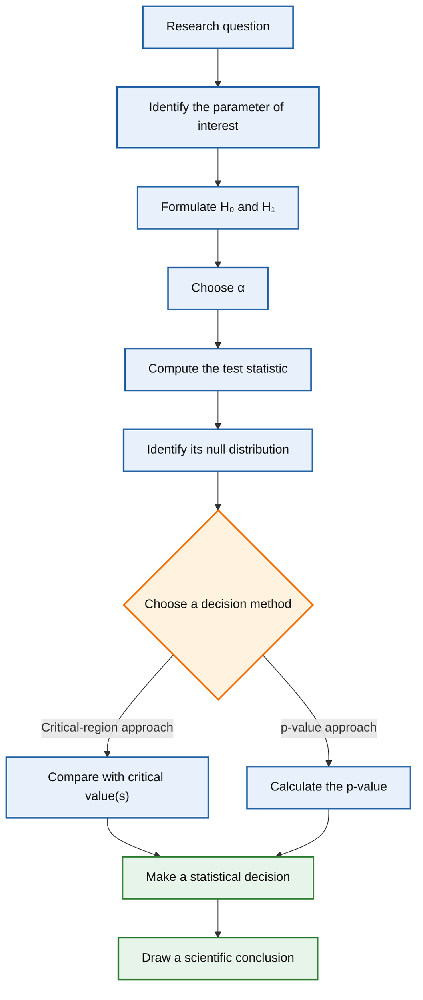
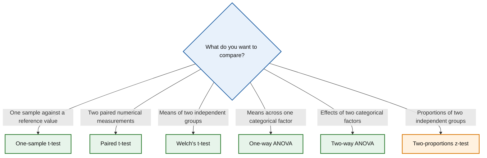

# Statistical Test Navigator

*One inferential workflow. Many statistical tests.*

All classical hypothesis tests follow the same workflow.

Once you understand that workflow, learning a new statistical test becomes much easier.

## The common hypothesis-testing workflow

Although statistical tests differ in their assumptions, test statistics,
and probability distributions, they all follow the same inferential
workflow.

### What remains constant and what changes?

| Common to every hypothesis test | Depends on the statistical test |
|---------------------------------|---------------------------------|
| Define the research question | Test statistic |
| Formulate the null and alternative hypotheses | Null distribution (t, z, F, χ², ...) |
| Choose the significance level (\(\alpha\)) | Assumptions |
| Compute the test statistic | Type of data |
| Obtain either the critical value(s) or the p-value | Conditions under which the test is applicable |
| Make a statistical decision | Interpretation specific to the method |

The goal of **StatNavigator** is to show that hypothesis tests share a
common inferential workflow. What changes from one method to another is
the test statistic, its null distribution, the underlying assumptions,
and the situations in which the method is appropriate.

Use the decision diagram to identify an appropriate statistical method,
then explore the method cards and conceptual guides to understand how
and why each procedure works.

## Choose a statistical method

## Available methods

### Comparison of means

- [One-sample t-test](tests/one-sample-t-test.md)  
  Compare a sample mean against a reference value.

- [Paired t-test](tests/paired-t-test.md)  
  Compare the mean difference between two related measurements.

- [Welch's t-test](tests/welch-t-test.md)  
  Compare the means of two independent groups without assuming equal variances.

- [One-way ANOVA](tests/one-way-anova.md)  
  Compare the means of three or more independent groups defined by a single categorical factor.

- [Two-way ANOVA](tests/two-way-anova.md)  
  Evaluate the effects of two categorical factors simultaneously and determine whether they interact.

### Comparison of proportions

- [Two-proportions z-test](tests/two-proportions-z-test.md)  
  Compare the success probabilities of two independent groups.

---

## Concepts

Statistical methods are easier to apply correctly when their underlying
ideas are understood.

- [Statistical hypotheses](concepts/hypotheses.md)  
  Learn how to formulate null and alternative hypotheses, what rejecting
  or failing to reject a hypothesis means, and why the claim to be
  supported is normally placed in \(H_1\).

- [One-sided and two-sided tests](concepts/one-sided-and-two-sided-tests.md)  
  Learn how the alternative hypothesis determines the rejection region,
  the direction of the statistical test and the interpretation of the
  p-value.

- [Probability distributions](concepts/probability-distributions.md)  
  Learn why every test statistic is a random variable, why hypothesis
  tests require a null distribution, and how different probability
  distributions arise in statistical inference.

- [Computing probabilities with the CDF](concepts/computing-probabilities-with-cdf.md)  
  Learn how to compute probabilities to the left, to the right and
  between two values using the cumulative distribution function (CDF).

- [Computing critical values with the PPF](concepts/computing-critical-values-with-ppf.md)
  Learn how to compute critical values for left-tailed, right-tailed and
  two-sided tests using the Percent Point Function (PPF).

- [Computing p-values](concepts/computing-p-values.md)
  Learn how to compute and interpret p-values, and how they are used
  together with the significance level to make statistical decisions.

- [Computing confidence intervals](concepts/computing-confidence-intervals.md)
  Learn how confidence intervals are constructed from a point estimate,
  the standard error and critical values obtained from the appropriate
  probability distribution.

- [Central Limit Theorem (CLT)](concepts/central-limit-theorem.md)
  Learn how the Central Limit Theorem makes statistical inference
  possible by describing the sampling distribution of the sample mean.

- [Standard Error of the Mean (SEM)](concepts/standard-error-of-the-mean.md)
  Learn how the Standard Error of the Mean quantifies the variability of
  sample means across repeated random samples.

- [Bessel's Correction](concepts/bessel-correction.md)
  Learn why sample variance is divided by n−1 instead of n, 
  and how Bessel's correction reduces the bias when estimating population variability.

- [Statistical Power](concepts/statistical-power.md)
  Learn how statistical power measures the ability of a hypothesis test to detect real effects, 
  and how it is influenced by sample size, effect size, variability and the significance level.

- [Statistical versus Practical Significance](concepts/statistical-versus-practical-significance.md)
  Learn how to distinguish between statistical evidence and practical importance when interpreting the results of hypothesis tests.

- [Equivalence and Non-Inferiority](concepts/equivalence-and-non-inferiority.md) 
  Learn how equivalence and non-inferiority tests provide evidence that a difference is small enough to be practically acceptable. 

*StatNavigator is under active development. Future additions will include
assumption checks, non-parametric methods, regression models, categorical
data analysis, and further conceptual guides.*
